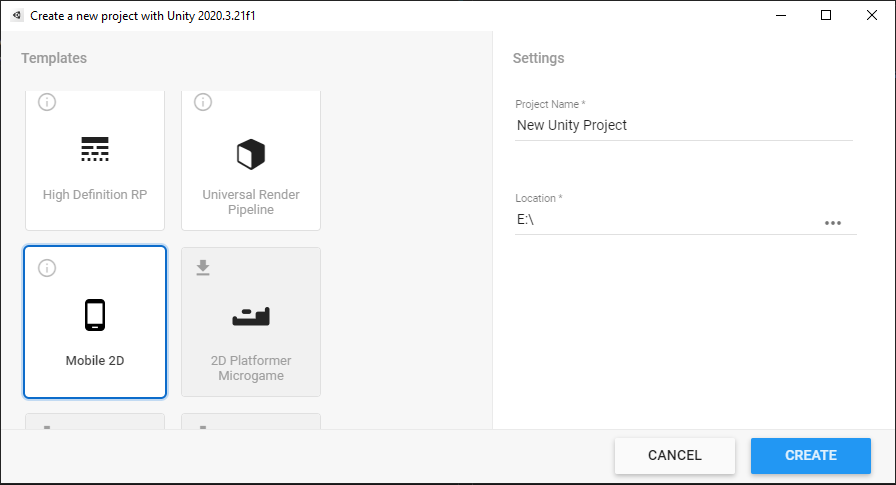
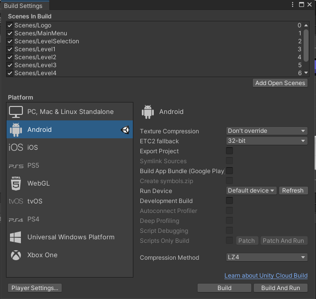

# Deep Sea Trial

## Budowanie
- Pobranie Unity https://unity3d.com/get-unity/download
- Utworzenie nowego projektu Unity

- Dodanie plików repozytorium do nowego utworzonego projektu
- W edytorze Unity wejście w File/Build settings
- Zaznaczenie platwormy android i kliknięcie Build

